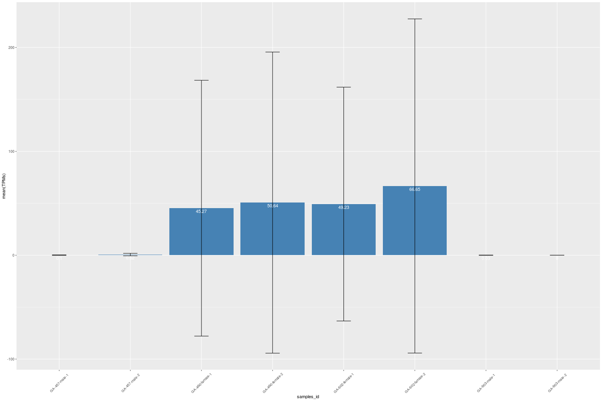
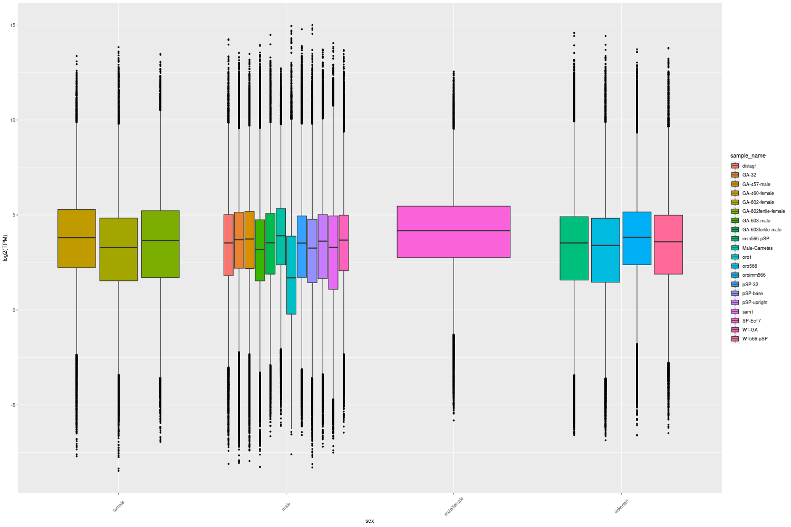

## Introduction
---

Shiny Transcriptomic Aggregator is a web-based application designed to explore RNA-seq data.
 The default dataset made available here is a collection of samples for the model brown alga Ectocarpus but the application can be run with any RNA-seq dataset provided using the "import new data" function.

The application consists of several tabs allowing users to easily import, analyze, visualize and explore RNA Seq data.

Some examples of Shiny Transcriptomic Aggregator graphic output are 
shown below.

 

	

		
Barplot

		

			
		

	

	

		
Boxplot

		

			
		

	

	

		
Heatmap

		

			
		

	

