

## RNAseq aggregator step by step
---

#### 1 - Take a look to the sample and gene tables in the "Ectocarpus datatables" tab.

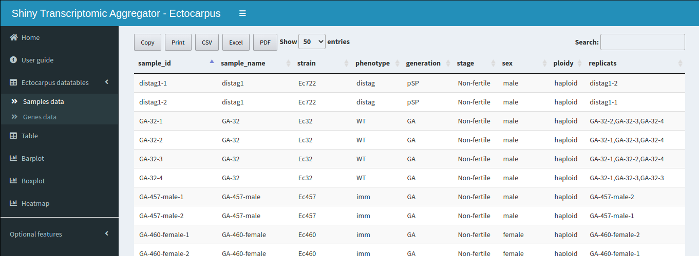 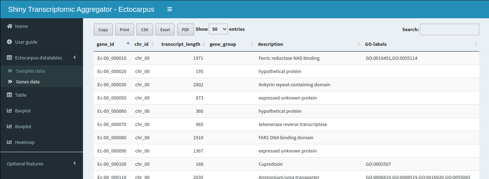 

#### 2 - Access to the "Table" tab to filter Ectocarpus data.

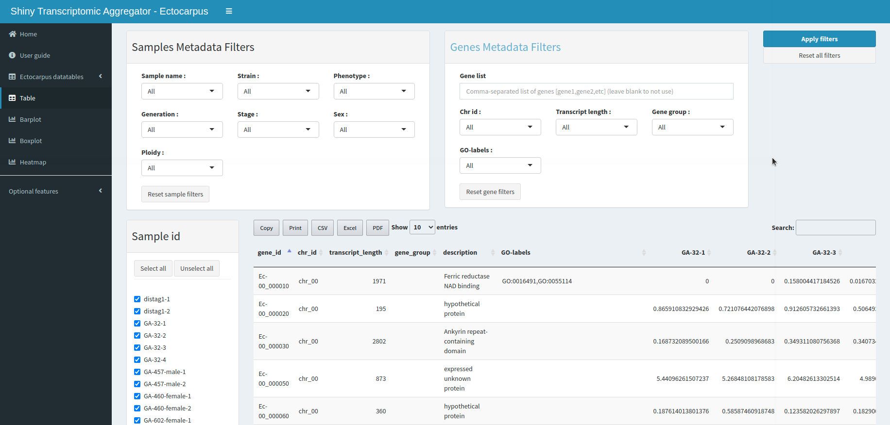

#### 3 - Select samples and/or genes filters and apply them with the "Apply filters" button.

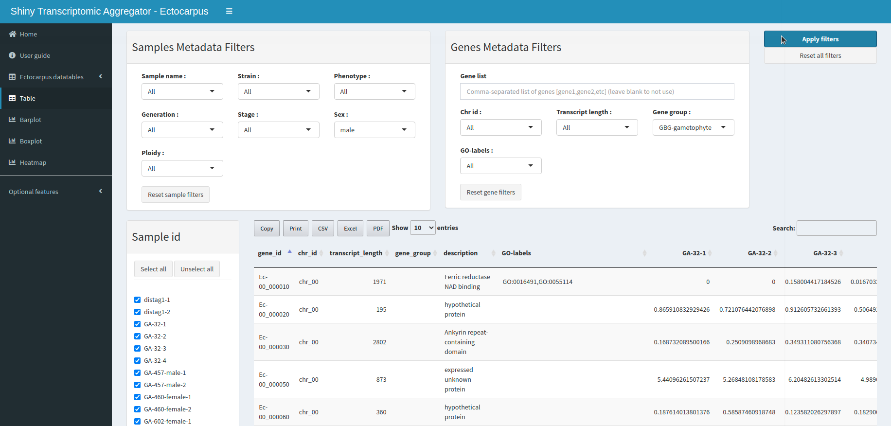

#### 4 - Build a plot of the filtered data in the plots tab. **Plots are built from the data displayed in the table tab.**

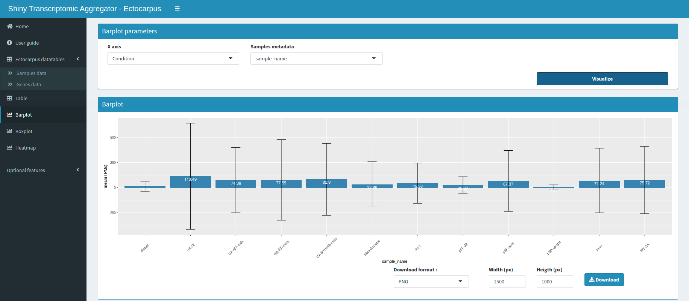 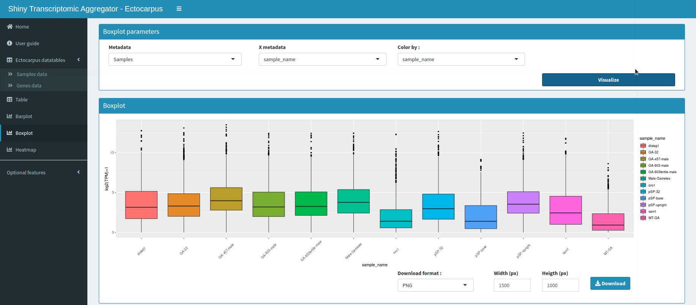
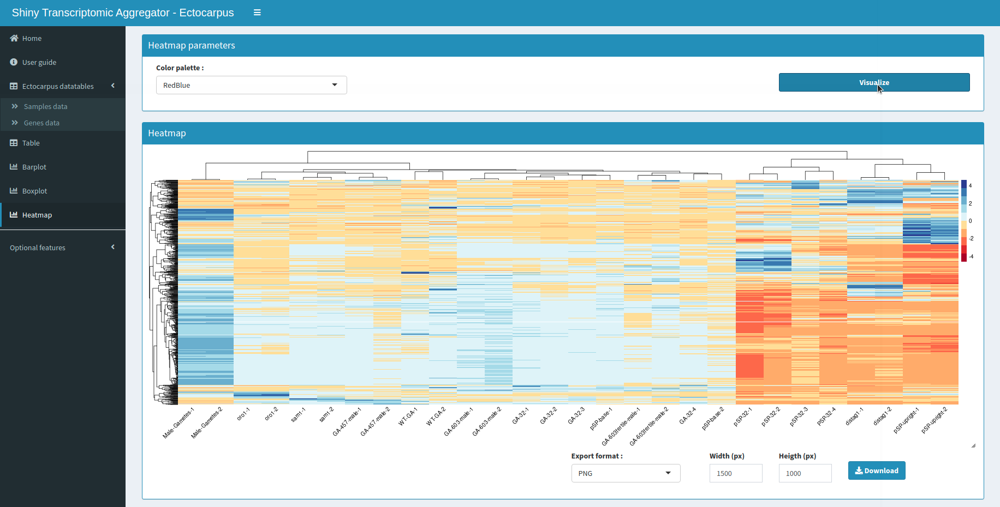

## Features
---

### Table
---

The table is the main part of Shiny Transcriptomic Aggregator.

It is used to analyze, visualize, explore and filter RNA Seq data.

It consists in two collapsible filter panels at the top of the page, one for sample metadata and the other for gene metadata, that are generated automatically from sample and gene files columns. 
Below these panels are a collapsible sample list and the table. 
The filter panels and the sample list allow selection and display of a subset of the table according to the filters chosen.

To apply filters, click on the "Apply filters" button in the upper right corner. This will update the table.

You can reset the filters by pressing the different reset filters buttons. 
Clicking on one of these buttons does not update the table. Don't forget to click on the "Apply filters" button afterwards.

The table is a dynamic overview of your data. Many features are provided such as searching, sorting or exporting for example.

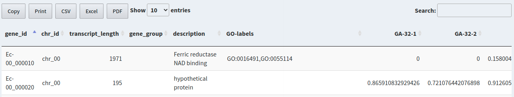

### Charts
---

3 charts are available :

<table>
  <tr>
    <td align="center">Barplot</td>
    <td align="center">Boxplot</td>
    <td align="center">Heatmap</td>
  </tr>
  <tr>
    <td>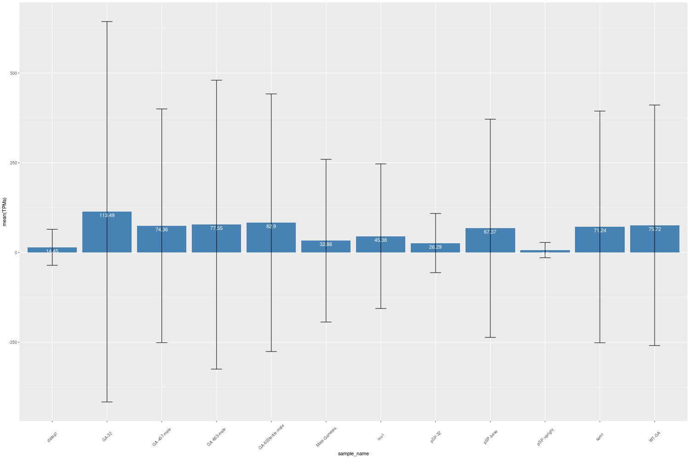</td>
    <td>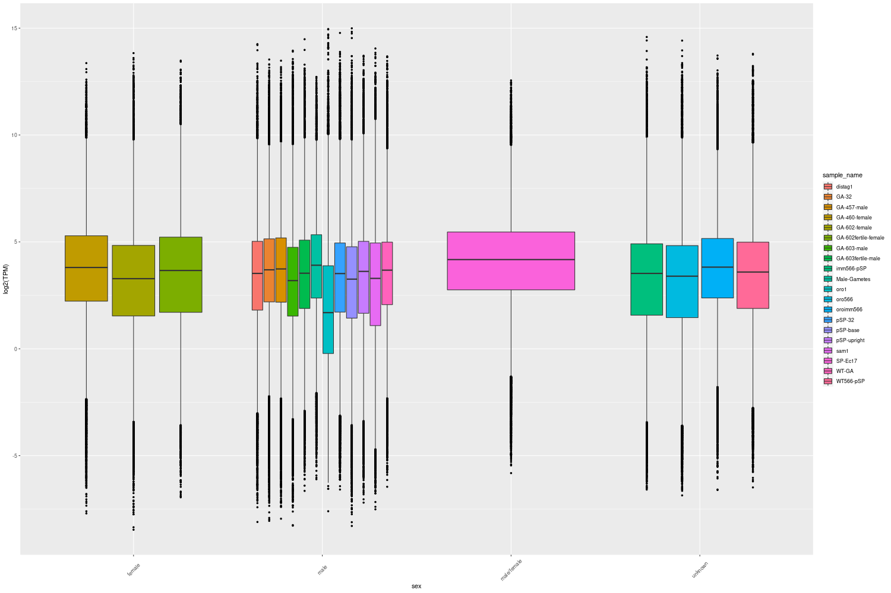</td>
    <td>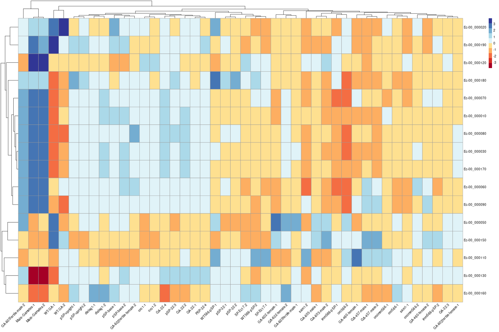</td>
  </tr>
</table>

Use the Visualize button to preview the generated graph. It can then be downloaded in different formats.

### Optional features
---

#### Import new data
---

You can import a new set of data using the file browsers in the "Import new data" tab.

Genes, samples and TPM data files are required in this case and should be constructed as follows :

- Genes data file (.csv)

	<table class = "table table-striped table-hover">
		<thead>
		  <tr>
		  	<th><u>gene_id*</u></th>
		  	<th>gene_metadata_1</th>
		  	<th>gene_metadata_2</th>
		  	<th>...</th>
		  </tr>
		 </thead>
		 <tbody>
		  <tr>
		   <td>(character)</td>
		   <td>(character)</td>
		   <td>(character)</td>
		   <td>...</td>
		  </tr>
		  <tr>
		   <td>gene1</td>
		   <td>value</td>
		   <td>value</td>
		   <td>...</td>
		  </tr>
		  <tr>
		   <td>gene2</td>
		   <td>value</td>
		   <td>value</td>
		   <td>...</td>
		  </tr>
		  <tr>
		   <td>...</td>
		   <td>...</td>
		   <td>...</td>
		   <td>...</td>
		  </tr>
	  </tbody>
	</table>

- Samples data file (.csv)

	<table class = "table table-striped table-hover">
		<thead>
		  <tr>
		  	<th><u>sample_id*</u></th>
		  	<th><u>sample_name</u></th>
		  	<th><u>private</u></th>
		  	<th>sample_metadata_1</th>
		  	<th>sample_metadata_2</th>
		  	<th>...</th>
		  </tr>
		 </thead>
		 <tbody>
		  <tr>
		   <td>(character)</td>
		   <td>(character)</td>
		   <td>(boolean)</td>
		   <td>(character)</td>
		   <td>(character)</td>
		   <td>...</td>
		  </tr>
		  <tr>
		   <td>sample1</td>
		   <td>name1_2</td>
		   <td>TRUE</td>
		   <td>value</td>
		   <td>value</td>
		   <td>...</td>
		  </tr>
		  <tr>
		   <td>sample2</td>
		   <td>name1_2</td>
		   <td>FALSE</td>
		   <td>value</td>
		   <td>value</td>
		   <td>...</td>
		  </tr>
		  <tr>
		   <td>...</td>
		   <td>...</td>
		   <td>...</td>
		   <td>...</td>
		   <td>...</td>
		   <td>...</td>
		  </tr>	  
	  </tbody>
	</table>

- TPMs file (.csv)

	<table class = "table table-striped table-hover">
		<thead>
		  <tr>
		  	<th><u>gene_id*</u></th>
		  	<th>sample1</th>
		  	<th>sample2</th>
		  	<th>...</th>
		  </tr>
		 </thead>
		 <tbody>
		  <tr>
		   <td>(character)</td>
		   <td>(numeric)</td>
		   <td>(numeric)</td>
		   <td>...</td>
		  </tr>
		  <tr>
		   <td>gene1</td>
		   <td>TPM</td>
		   <td>TPM</td>
		   <td>...</td>
		  </tr>
		  <tr>
		   <td>gene2</td>
		   <td>TPM</td>
		   <td>TPM</td>
		   <td>...</td>
		  </tr>
		  <tr>
		   <td>...</td>
		   <td>...</td>
		   <td>...</td>
		   <td>...</td>
		  </tr>
	  </tbody>
	</table>

*(&ast;) gene_id and sample_id should be unique*

*<u>Underlined</u> columns are required and should be named as above*

*Avoid using hyphens (-) in your tables, underscores (_) are OK.*